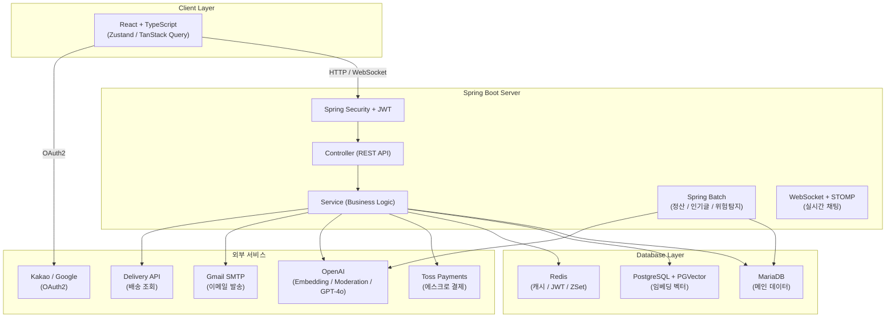
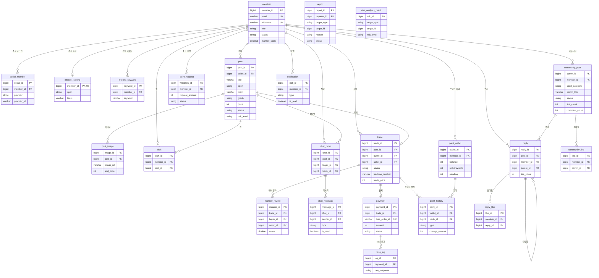

# RE:FORM

[](https://openjdk.org/)
[](https://spring.io/projects/spring-boot)
[](https://mariadb.org/)
[](https://www.postgresql.org/)
[](https://redis.io/)
[](https://react.dev/)

> 다양한 종목의 스포츠 팬이 유니폼을 안전하게 거래하고 팬덤 문화를 나눌 수 있는 **스포츠 유니폼 전문 중고거래 & 커뮤니티 웹 서비스**

---

## 목차

- [팀원 소개](#팀원-소개)
- [프로젝트 소개](#프로젝트-소개)
- [기술 의사결정](#기술-의사결정)
- [시스템 아키텍처](#시스템-아키텍처)
- [주요 기능](#주요-기능)
- [기술 스택](#기술-스택)
- [로컬 환경 설정](#로컬-환경-설정)
- [트러블슈팅](#트러블슈팅)
- [팀 회고](#팀-회고)
- [팀 문서](#팀-문서)

---

## 팀원 소개

| 이름 | 기획 | 백엔드 | 비고 |
|------|------|--------|------|
| 김민기 | 프로젝트 설계 리딩, 유스케이스 정의, ERD 구성 및 DB 설계 | JWT 인증/인가, OAuth2, 판매글 CRUD, 거래, Delivery API, Redis, Spring AOP 성능 모니터링, AI 위험 탐지 | |
| 손민정 | 요구사항 정의서, 유스케이스, 테이블 정의서, 스토리보드 | Toss Payments 에스크로 결제, Spring Batch 정산 자동화, OpenAI Embedding + PGVector 의미 검색, AI 위험 탐지, 인기글 집계 | |
| 진혜림 | 테이블 설계서, 기능 설명서 작성 | WebSocket + STOMP 실시간 채팅, 커뮤니티 CRUD, OpenAI GPT-4o Vision 판매글 이미지 자동 분석, OpenAI Moderation 유해성 검사 | |
| 최민종 | UI/UX 설계, 디자인 시스템 구축 | React + TypeScript 전체 뷰 개발 전담, Zustand 전역 상태 관리, TanStack Query, 반응형 + 다크모드 | 프론트엔드 |

---

## 프로젝트 소개

### 개발 배경

- 기존 중고거래 플랫폼(당근, 번개장터)은 범용 서비스로 마킹, 시즌, 구단 등 **유니폼 고유 속성 기반 탐색이 불가능**
- 희귀·한정판 유니폼의 경우 진위 확인이 어렵고 리셀러가 선점 후 고가에 재판매하는 **구조적 문제** 존재
- 스포츠 팬덤 커뮤니티가 여러 플랫폼에 분산되어 **거래와 커뮤니티 간 연결점 부재**

### 목적

- 스포츠 유니폼 특화 필터와 AI 유사 검색으로 원하는 유니폼을 빠르게 탐색할 수 있는 **전문 버티컬 마켓 구축**
- **에스크로 결제**로 안전한 거래 환경 조성
- 거래와 커뮤니티를 하나의 플랫폼에서 경험하여 **스포츠 팬덤 활성화**

### 개발 기간 및 팀 구성

- 개발 기간: 2026.05
- 팀 구성: 4인 (백엔드 3 + 프론트엔드 1)

---

## 기술 의사결정

### Spring Batch

> 자동 구매 확정(수령 후 5일), 포인트 정산, 인기글 집계(1시간), AI 위험 탐지(6시간) 등 주기적으로 실행해야 하는 작업들이 여러 개였습니다. @Scheduled만으로는 실패 처리, 재시도, 실행 이력 관리가 어렵기 때문에 Spring Batch를 도입하여 각 Job을 독립적으로 관리했습니다.

### OpenAI Embedding + PGVector

> 기존 LIKE 기반 키워드 검색은 "첼시 홈킷", "블루스" 같은 한글 별칭 검색이 불가능합니다. 게시글을 벡터로 변환해 PGVector에 저장하고 cosine 유사도 검색을 적용하여 의미 기반 검색을 구현했습니다. 팀 별칭 Map으로 한글/영문 혼용 및 축약어 검색을 지원합니다.

### Toss Payments 에스크로

> 중고거래 특성상 구매자-판매자 간 신뢰 문제가 핵심입니다. 에스크로 방식으로 구매자 결제 금액을 플랫폼이 보관하고, 구매 확정 시에만 판매자에게 정산하여 안전한 거래 환경을 구성했습니다.

### 멀티 데이터소스 (MariaDB + PostgreSQL + Redis)

> 도메인 특성에 따라 저장소를 분리했습니다. MariaDB는 거래 도메인 전반(@Primary), PostgreSQL + PGVector는 임베딩 벡터 저장 및 유사도 검색, Redis는 인기글 ZSet 캐싱 및 JWT 토큰 관리에 사용합니다. MariaDBConfig를 @Primary로 설정하고 MyBatis는 수동 설정으로 분리하여 JPA/Spring Batch DataSource 충돌을 방지했습니다.

### WebSocket + STOMP

> 채팅은 HTTP 폴링 방식으로는 실시간성을 보장하기 어렵습니다. WebSocket + STOMP 프로토콜을 적용하여 실시간 메시지 송수신을 구현하고, OpenAI Moderation API 연동으로 유해 메시지를 실시간으로 탐지합니다.

---

## 시스템 아키텍처



### 배치 아키텍처

| Job명 | 실행 주기 | 용도 |
|-------|-----------|------|
| `dailyBatchJob` | 매일 새벽 4시 | 자동 구매 확정 + 포인트 정산 |
| `popularCommunityPostJob` | 1시간마다 | 인기글 집계 → Redis ZSet 저장 |
| `riskDetectionJob` | 6시간마다 | 위험 콘텐츠 AI 탐지 |
| `userBehaviorSyncScheduler` | 10분마다 | 행동 이력 Redis → MariaDB 동기화 |

---

## ERD



### 테이블 목록 (총 23개)

| 도메인 | 테이블 | 설명 |
|--------|--------|------|
| 회원 | `member` | 회원 기본 정보 |
| 회원 | `social_member` | 카카오/구글 OAuth2 연동 |
| 회원 | `interest_setting` | 관심 종목·구단 설정 |
| 회원 | `interest_keyword` | 관심 키워드 목록 |
| 거래 | `post` | 유니폼 판매글 |
| 거래 | `post_image` | 판매글 이미지 |
| 거래 | `wish` | 찜하기 |
| 거래 | `trade` | 거래 상태 관리 |
| 거래 | `manner_review` | 매너 평가 |
| 채팅 | `chat_room` | 채팅방 |
| 채팅 | `chat_message` | 채팅 메시지 |
| 결제 | `payment` | Toss 결제 정보 |
| 결제 | `toss_log` | Toss API 원문 응답 (append-only) |
| 결제 | `point_wallet` | 포인트 지갑 |
| 결제 | `point_history` | 포인트 입출금 이력 |
| 결제 | `point_request` | 출금 신청 |
| 커뮤니티 | `community_post` | 커뮤니티 게시글 |
| 커뮤니티 | `reply` | 댓글·대댓글 |
| 커뮤니티 | `community_like` | 게시글 좋아요 |
| 커뮤니티 | `reply_like` | 댓글 좋아요 |
| 기타 | `report` | 신고 |
| 기타 | `notification` | 알림 |
| AI | `risk_analysis_result` | AI 위험 탐지 결과 |

---

## 주요 기능

### 회원 및 인증

- 이메일 회원가입 / 카카오·구글 OAuth2 로그인
- Spring Security + JWT (액세스 토큰 / 리프레시 토큰, Rotation 적용)
- 이메일 2차 인증코드 검증 후 최종 로그인 처리
- Redis 블랙리스트 기반 로그아웃, 다중 세션 관리
- 관심 종목·팀·키워드 설정 기반 맞춤 피드 및 알림

### 유니폼 거래

- 판매글 CRUD 및 이미지 업로드
- 종목·구단·마킹·시즌·상태 등급 복합 필터 및 최신순·인기순·가격순 정렬
- 찜하기, 조회수, 신고 기능

### 채팅

- WebSocket + STOMP 기반 실시간 메시지 송수신 (텍스트 + 이미지)
- OpenAI Moderation API 실시간 유해 메시지 탐지
- 채팅 미읽음 알림, 입장 시 일괄 읽음 처리

### 결제 및 정산

- Toss Payments 에스크로 기반 안전결제 (초기화 → 승인 → 취소/환불)
- Spring Batch 자동 구매 확정 (수령 후 5일 경과) 및 수수료 5% 차감 후 판매자 포인트 정산
- 포인트 지갑 조회, 출금 신청·취소 및 관리자 승인·반려 흐름

| 이벤트 | 잔액(balance) | 출금가능(withdrawable) | 대기(pending) |
|--------|:---:|:---:|:---:|
| 거래 완료 | - | - | +거래금액 |
| 구매 확정 | +지급포인트 | +지급포인트 | -거래금액 |
| 출금 신청 | - | -출금액 | +출금액 |
| 출금 승인 | -출금액 | - | -출금액 |
| 출금 반려/취소 | - | +출금액 | -출금액 |

### 검색

- 키워드·필터·정렬 복합 검색 및 페이지네이션
- OpenAI Embedding + PGVector cosine 유사도 기반 의미 검색 (threshold 0.7)
- 팀 별칭 Map으로 한글/영문 혼용 및 축약어 검색 지원
- LinkedHashSet으로 AI 결과 우선, 키워드 결과 중복 제거 후 병합

### 커뮤니티

- 게시글·댓글·대댓글·좋아요 토글
- 작성자 익명 처리 (작성자 = 글쓴이, 그 외 = 익명1, 익명2 순)
- Spring Batch + Redis ZSet 기반 1시간 주기 인기글 자동 집계
  - 점수 공식: `조회수 × 1 + 좋아요 × 3 + 댓글 × 2`

### AI 기능

#### GPT-4o Vision — 판매글 이미지 자동 분석 (`AiListingService`)

판매글 작성 시 이미지를 업로드하면 GPT-4o Vision이 이미지를 분석하여 제목과 설명을 자동으로 제안합니다.

**처리 흐름**

```
[이미지 업로드] contentType + byte[]
        ↓
  SystemMessage: "중고 스포츠 유니폼 판매 전문가" 역할 부여
  + JSON 형식 지정 (title / description)
        ↓
  UserMessage: Media 객체(이미지 바이트) + 분석 요청 텍스트
        ↓
  Spring AI ChatClient → GPT-4o Vision 호출
        ↓
  응답 JSON 파싱 (마크다운 코드블록 자동 제거)
        ↓
  AiListingSuggestResponseDTO 반환 (실패 시 fallback)
```

**출력 규격**

| 필드 | 규격 |
|------|------|
| `title` | 20자 이내, 종목·브랜드·사이즈 포함 |
| `description` | 150자 이내, 상태·특징·사이즈 포함 |

**API**

```
POST /api/ai/listing/suggest
Content-Type: multipart/form-data
Body: image (file)
```

---

#### OpenAI Moderation API — 위험 콘텐츠 탐지 (`ModerationService`)

채팅 메시지 및 게시글(POST / CHAT)을 2단계로 검사하고 결과를 `risk_analysis_result` 테이블에 저장합니다.

**2-Tier 탐지 구조**

```
[콘텐츠 입력]
        ↓
  [Tier 1] ModerationKeyword (로컬 키워드 필터)
    - NFKC 정규화 + 소문자 변환 + 특수문자 제거
    - 9개 정규식 패턴 매칭 (욕설, 사기 유도, 위조품 등)
    - 매칭 시 즉시 HIGH/MID 반환 (API 호출 없이 빠른 차단)
        ↓ (미매칭 시)
  [Tier 2] OpenAI Moderation API
    - ModerationModel.call(ModerationPrompt)
    - 위반 카테고리 분석 → ModerationCategory Enum 매핑
    - 최고 RiskLevel 산출
        ↓
  ChatGPT로 개선 제안 생성 (한국어 1~2문장)
        ↓
  DB 저장 / 갱신 / 삭제 (flagged 여부에 따라)
  API 장애 시 fallback → 정상(safe) 처리
```

**로컬 키워드 규칙 (총 9개)**

| 패턴 예시 | 사유 | 등급 |
|-----------|------|:----:|
| `선불\|계좌이체` | 사기 위험 거래 유도 | MID |
| `가품\|도용` | 위조품·권리 침해 의심 | HIGH |
| `씨+발`, `병+신` 등 | 강한 욕설 / 공격적 표현 | HIGH |
| `죽어\|뒤져` | 폭력적·위협적 표현 | HIGH |

**위험 등급별 처리**

| 등급 | OpenAI 카테고리 | 처리 |
|------|----------------|------|
| HIGH | 혐오+위협, 자해 안내, 미성년자 성적 콘텐츠 | DB 저장 → 관리자 검토 |
| MID | 차별/비하, 폭력, 불법 | DB 저장 → 관리자 검토 |
| LOW | 성적 콘텐츠 | DB 저장 → riskLevel 업데이트 |
| 정상 | - | 기존 탐지 결과 DB에서 삭제 |

**탐지 대상 분류**

| TargetType | 탐지 시점 | DB 저장 |
|-----------|-----------|:-------:|
| `CHAT` | 채팅 메시지 전송 시 실시간 | ✅ |
| `POST` | 게시글 작성/수정 시 즉시 + Spring Batch 6시간 주기 | ✅ |
| 임시저장(`checkDraft`) | 저장 전 사전 검사 | ❌ (transient) |

**Spring Batch 연동**

`riskDetectionJob`이 6시간마다 전체 게시글을 순회하며 `ModerationService.checkAndSave()`를 호출합니다. 신규 게시글 작성 시 실시간 검사와 병행하여 누락 없이 커버합니다.

### AI 개인화 추천

> 기존 파일 수정 없이 신규 파일 12개 추가만으로 구현 (AOP 활용)

**추천 흐름**

```
[유저 행동] 게시글 클릭 / 검색 키워드 입력
        ↓ (AOP 자동 감지)
     Redis에 임시 저장
        ↓ (10분마다 배치)
     MariaDB (user_view_log, user_search_log)
        ↓
[추천 요청 시]
interest_setting + interest_keyword (가입 시 설정)
  + 최근 조회 이력 (빈도 × 최근성 가중치)
  + 최근 검색어 (빈도 × 최근성 가중치)
        ↓
  선호도 텍스트 → OpenAI Embedding → PGVector 유사도 검색
        ↓
  이미 본 게시글 제외 (viewedPostIds Set 필터)
        ↓
  추천 게시글 반환
```

**선호도 가중치 설계**

| 데이터 소스 | 기본 가중치 | 최근성 보너스 |
|------------|:---------:|:------------:|
| interest_setting (sport/team) | 2회 반복 | - |
| interest_keyword | 1회 반복 | - |
| 조회 이력 sport/team | 빈도 ÷ 3 | 3일↓=4배, 7일↓=3배, 30일↓=2배 |
| 검색 키워드 | 빈도 ÷ 2 | 동일 |

**Redis 키 설계**

| Redis Key | 타입 | 내용 |
|-----------|------|------|
| `behavior:view:{memberId}` | List | 조회 이력 JSON (TTL 30일) |
| `behavior:search:{memberId}` | List | 검색 이력 JSON (TTL 30일) |
| `behavior:active:members` | Set | 배치 처리 대기 memberId 목록 |

**API**

```
GET /api/recommendations?size=10
```
- 로그인 필수 (비로그인 시 빈 배열 반환)
- size 기본 10, 최대 50
- 추천 이유: 조회+검색 이력 5건 이상 → "최근 활동 기반 추천", 미만 → "관심 종목 기반 추천"

---

## 기술 스택

### Backend

| 항목 | 기술 / 버전 |
|------|------------|
| Language | Java 21 |
| Framework | Spring Boot 4.0.6 |
| ORM | Spring Data JPA |
| SQL Mapper | MyBatis 3.0.5 |
| Batch | Spring Batch |
| Security | Spring Security + OAuth2 Client |
| JWT | jjwt 0.12.7 |
| WebSocket | Spring WebSocket (STOMP) |
| AI | Spring AI 2.0.0-M5 (OpenAI 연동) |
| WebClient | Spring WebFlux |
| AOP | AspectJ Weaver |
| API Docs | springdoc-openapi 3.0.3 (Swagger UI) |
| Object Mapping | ModelMapper 3.2.5 |
| Lombok | Lombok |

**패키지 구조**

```
com.re_form_shop_2605/
├── config/              # 설정 (Security, Redis, Stomp, Swagger, Batch, DB, Payment 등)
├── controller/          # REST API 엔드포인트
│   ├── admin/           # 관리자 (회원·게시글·신고·위험탐지·출금 관리)
│   ├── chat/            # 채팅
│   ├── community/       # 커뮤니티 게시글·댓글
│   ├── delivery/        # 배송 조회
│   ├── draft/           # 임시저장
│   ├── login/           # 인증 (이메일·OAuth2·JWT)
│   ├── member/          # 회원·관심설정
│   ├── payment/         # 결제·포인트·출금
│   ├── statistics/      # 통계
│   └── trade/           # 판매글·거래
├── service/             # 비즈니스 로직
│   └── AI/              # 추천·위험탐지·임베딩·유해성검사
├── repository/          # Spring Data JPA Repository
│   └── AI/              # UserViewLog·UserSearchLog
├── mapper/              # MyBatis Mapper (복잡 쿼리)
├── entity/              # JPA 엔티티
│   ├── chat/            # ChatRoom, ChatMessage
│   ├── community/       # CommunityPost, Reply, CommunityLike, ReplyLike
│   ├── etc/             # Notification, Report
│   ├── member/          # Member, SocialMember, InterestSetting, InterestKeyword
│   ├── payment/         # Payment, TossLog, PointWallet, PointHistory, PointRequest
│   ├── trade/           # Post, PostImage, Trade, Wish, MannerReview
│   ├── AI/              # RiskAnalysisResult
│   └── Enum/            # 전체 Enum 타입 (Sport, TradeStatus, RiskLevel 등 20+)
├── dto/                 # 요청·응답 DTO
├── security/            # JWT 필터·핸들러, OAuth2 UserService
├── performance/         # AOP 성능 모니터링 (PerformanceAspect)
└── domain/              # MyBatis용 도메인 객체
```

**SQL 초기화 파일** (`src/main/resources/sql/`)

| 파일 | 용도 |
|------|------|
| `init.sql` | 테이블 DDL 초기화 |
| `dummy.sql` | 개발용 더미 데이터 |
| `TestData.sql` | 테스트 데이터 |

### Database

| 분류 | 용도 | 주요 데이터 |
|------|------|------------|
| MariaDB | 메인 데이터베이스 (@Primary) | 회원, 게시글, 거래, 결제, 포인트 |
| PostgreSQL + PGVector | 벡터 데이터베이스 | 게시글 임베딩 벡터 |
| Redis | 캐시 | 인기글 ZSet, JWT 블랙리스트 |

### Frontend

| 항목 | 기술 |
|------|------|
| Framework | React + TypeScript (Vite) |
| 상태 관리 | Zustand (전역), TanStack Query (서버) |
| HTTP | Axios |
| 라우팅 | React Router DOM |
| WebSocket | @stomp/stompjs |
| 결제 | @tosspayments/payment-widget-sdk |
| 아이콘 | lucide-react |
| 스타일 | Tailwind CSS, 반응형, 다크모드 |

**패키지 구조** ([re-form-view](https://github.com/Re-form-shop/reform-view))

```
src/
├── features/          # 도메인별 API + Hook 묶음
│   ├── auth/          # 로그인, 회원가입, OAuth2
│   ├── listing/       # 판매글 목록/상세/작성
│   ├── trade/         # 거래 흐름 (수락·배송·확정)
│   ├── payment/       # Toss Payments 결제 위젯
│   ├── chat/          # WebSocket 채팅
│   ├── community/     # 게시글·댓글·좋아요
│   ├── mypage/        # 프로필·관심·구매내역·포인트
│   ├── notification/  # 알림 조회·읽음 처리
│   ├── delivery/      # 배송 조회
│   ├── draft/         # 게시글 임시저장
│   ├── report/        # 신고
│   └── admin/         # 관리자 API
├── pages/             # 라우트 단위 페이지 컴포넌트
│   ├── auth/          # 로그인·회원가입 페이지
│   ├── listing/       # 판매글 목록·상세·작성 페이지
│   ├── trade/         # 거래 페이지
│   ├── payment/       # 결제 페이지
│   ├── chat/          # 채팅 페이지
│   ├── community/     # 커뮤니티 페이지
│   ├── mypage/        # 마이페이지
│   ├── search/        # 검색 페이지
│   └── admin/         # 관리자 페이지
├── components/
│   ├── layout/        # 공통 레이아웃 (헤더, 사이드바 등)
│   └── ui/            # 공통 UI 컴포넌트
├── store/             # Zustand 전역 상태 (authStore 등)
├── hooks/             # 공통 커스텀 훅 (useTheme 등)
├── lib/               # axios 인스턴스, queryClient 설정
├── types/             # TypeScript 타입 정의
└── utils/             # 포맷·이미지·유해성 검사 유틸
```

### 외부 서비스

| 서비스 | 용도 |
|--------|------|
| Toss Payments | 에스크로 결제, 승인/취소/환불 |
| OpenAI Embedding | 게시글 벡터 임베딩 생성 |
| OpenAI Moderation API | 위험 콘텐츠 유해성 분석 |
| OpenAI GPT-4o Vision | 판매글 이미지 분석 → 제목·설명 자동 생성 |
| Kakao / Google OAuth2 | 소셜 로그인 |
| Gmail SMTP | 회원 이메일 발송 |
| Delivery API | 배송 추적 |

---

## 환경 설정

### 벡터 검색 (PGVector) 환경 구성

#### 1. Docker pgvector 컨테이너 실행

처음 설치하는 경우:

```bash
docker run -d \
  --name pgvector \
  -e POSTGRES_PASSWORD=postgres \
  -p 5432:5432 \
  pgvector/pgvector:pg16
```

이미 컨테이너가 있는 경우:

```bash
docker start <컨테이너ID>
```

#### 2. reform_vector DB 생성

```bash
docker exec -it <컨테이너ID> psql -U postgres -c "CREATE DATABASE reform_vector;"
```

#### 3. PGVector 확장 설치

```bash
docker exec -it <컨테이너ID> psql -U postgres -d reform_vector -c "CREATE EXTENSION IF NOT EXISTS vector;"
```

설치 확인:

```bash
docker exec -it <컨테이너ID> psql -U postgres -d reform_vector -c "SELECT * FROM pg_extension WHERE extname = 'vector';"
```

#### 4. application.properties 추가

```properties
# PostgreSQL (PGVector용)
spring.datasource.postgres.url=jdbc:postgresql://localhost:5432/reform_vector
spring.datasource.postgres.username=postgres
spring.datasource.postgres.password=postgres
spring.datasource.postgres.driver-class-name=org.postgresql.Driver

# Spring AI PGVector
spring.ai.vectorstore.pgvector.initialize-schema=false
spring.ai.vectorstore.pgvector.dimensions=1536
spring.ai.vectorstore.pgvector.distance-type=COSINE_DISTANCE

# OpenAI
spring.ai.openai.api-key=${OPENAI_API_KEY}
```

#### 5. .env 파일에 추가

프로젝트 루트의 `.env` 파일에 아래 항목 추가:

```
OPENAI_API_KEY=키_입력되어_있는지_확인
```

> OpenAI API 키는 https://platform.openai.com 에서 발급

#### 6. build.gradle 의존성 확인

아래 항목이 있는지 확인 (없으면 추가 후 Gradle 새로고침):

```groovy
runtimeOnly 'org.postgresql:postgresql'
implementation 'org.springframework.ai:spring-ai-starter-vector-store-pgvector'
implementation 'org.springframework.ai:spring-ai-starter-model-openai'
```

#### 추가된 Config 파일

| 파일 | 역할 |
|------|------|
| `MariaDBConfig.java` | MariaDB DataSource 수동 설정 (@Primary, JPA/MyBatis 기본 DB) |
| `PostgreSQLConfig.java` | PostgreSQL DataSource + PgVectorStore 빈 설정 (AI 벡터 검색용) |

> DB가 두 개라 Spring Boot 자동 설정 충돌 방지를 위해 수동 설정 필요. MariaDBConfig에 `@Primary`가 붙어있으므로 JPA/MyBatis는 MariaDB를 사용.

#### 주의사항

- 서버 실행 전 반드시 Docker pgvector 컨테이너 실행
- `.env` 파일에 `OPENAI_API_KEY` 없으면 서버 실행 시 오류
- `reform_vector` DB가 없으면 서버 실행 시 오류

---

## 트러블슈팅

### 1. 멀티 데이터소스 환경에서 JPA / Spring Batch DataSource 충돌

**문제**
> MariaDB와 PostgreSQL을 동시에 사용하는 멀티 데이터소스 구성 시, JPA와 Spring Batch가 DataSource를 자동 감지하는 과정에서 충돌이 발생했습니다.

**원인**
> Spring Boot가 여러 DataSource Bean 중 어느 것을 Primary로 사용할지 결정하지 못해 Bean 등록 오류가 발생했습니다.

**해결**
> MariaDBConfig를 `@Primary`로 설정하고 MyBatis는 수동 설정으로 분리하여 각 DataSource의 용도를 명확히 구분했습니다.

---

### 2. AI 의미 검색 유사도 평준화 문제

**문제**
> OpenAI Embedding으로 한글 게시글을 벡터화했을 때 유사도 점수가 전반적으로 비슷하게 나와 검색 결과 품질이 낮았습니다.

**원인**
> OpenAI Embedding 모델이 영어 기반이라 한글 텍스트의 의미 차이를 세밀하게 구분하지 못하고, 더미 데이터가 동일 템플릿으로 생성되어 content 유사도가 평준화되었습니다.

**해결**
> threshold를 0.7로 설정하고, AI 검색 결과와 키워드(LIKE) 검색 결과를 LinkedHashSet으로 병합 시 AI 결과를 우선 배치하여 보완했습니다.

**개선 방향**
> 실서비스에서는 다양한 실제 데이터로 해결 가능하며, 한국어 특화 임베딩 모델 도입을 고려합니다.

---

### 3. 계좌 실명 인증 API 사용 불가

**문제**
> 출금 신청 시 계좌 실명 인증이 필요하지만, 금융결제원 오픈뱅킹 계좌실명조회 API는 기관 이용 적합성 승인이 필요하여 개인 개발자가 사용할 수 없었습니다. Toss Payments 계좌인증 API, UseB, Hypen 등 대체 방안도 별도 기업 계약 또는 사업자번호를 필요로 했습니다.

**해결**
> 금융결제원 개발자 사이트 API Key로 Access Token을 발급받아 요청/응답 구조를 직접 확인하고, 인터페이스로 추상화하여 실제 운영 시 Service 구현체만 교체할 수 있도록 설계했습니다.

---

### 4. AI 추천 — Redis 역직렬화 ClassCastException

**문제**
> `UserBehaviorSyncScheduler` 배치 실행 시 Redis에서 꺼낸 객체를 `UserViewRedisDTO`로 캐스팅하는 과정에서 `ClassCastException`이 발생했습니다.

**원인**
> `GenericJacksonJsonRedisSerializer`가 타입 정보(`@class`)와 함께 직렬화하는데, DTO에 `@NoArgsConstructor`가 없으면 역직렬화 시 기본 생성자를 찾지 못해 실패합니다.

**해결**
> `UserViewRedisDTO`, `UserSearchRedisDTO`에 `@NoArgsConstructor`를 추가했습니다. 또한 `LocalDateTime` 직렬화 이슈를 방지하기 위해 타임스탬프를 epoch milliseconds(`long`)으로 저장하도록 변경했습니다.

---

### 5. AI 추천 결과 0건 — 이미 본 게시글이 계속 추천됨

**문제**
> 배치 주기(10분)가 지나기 전에는 Redis에만 조회 이력이 있고 DB에 반영되지 않아, 이미 본 게시글이 계속 추천되었습니다.

**원인**
> 이미 본 게시글 필터가 `user_view_log`(MariaDB) 기준으로만 동작하여 Redis에 아직 있는 미반영 이력을 걸러내지 못했습니다.

**해결**
> `viewedPostIds` 수집 시 MariaDB 조회 결과에 Redis 조회 이력을 추가로 합산하여 실시간 필터링이 되도록 수정했습니다.

---

### 6. 비동기 통신에서 서버 리다이렉트 미동작

**문제**
> WebClient 비동기 요청에서 서버가 리다이렉트 응답을 보냈으나 클라이언트 화면 이동이 되지 않았습니다.

**원인**
> fetch API는 서버의 리다이렉트 응답을 브라우저 주소창 이동으로 처리하지 않고 내부적으로 처리하며, 커스텀 응답 헤더도 브라우저 보안 정책으로 읽히지 않았습니다.

**해결**
> 특정 상태를 별도 HTTP 상태코드로 구분하고, 클라이언트에서 해당 코드를 받았을 때 직접 페이지 이동하도록 처리했습니다.

---

## 팀 회고

**김민기**
> 기획부터 설계, 구현, 테스트까지 짧은 시간 안에 완수하느라 매일이 치열했지만, 그만큼 값진 성장을 이룬 프로젝트였습니다. 특히 까다로웠던 시큐리티와 OAuth2, JWT 구현 과정에서는 많은 시행착오를 겪었지만, 끝내 완성해내며 큰 성취감을 느꼈습니다. Redis를 도입해 게시글 자동 저장, JWT 토큰 관리, AOP 기반 성능 측정까지 구현해 본 것은 매우 즐거운 도전이었습니다.

**손민정**
> 에스크로 방식의 안전결제 구조를 설계해 Toss Payments API를 연동하고, MariaDB·PostgreSQL·Redis를 목적에 맞게 분리 구성하여 데이터 특성에 따른 저장소 설계를 고민했습니다. 단순히 하나의 기술을 배우는 것에 그치지 않고, 목적에 맞게 기술을 조합해 하나의 기능으로 완성하는 경험을 했습니다.

**진혜림**
> WebSocket + STOMP, OpenAI Moderation API, GPT-4o Vision을 직접 다뤄볼 수 있어 좋은 계기가 되었습니다. React 프론트엔드 담당자와 역할을 분리하여 협업하면서 API 응답 구조를 프론트에 맞게 설계하는 경험을 쌓을 수 있었고, 실무에 가까운 협업 방식을 익히는 데 큰 도움이 되었습니다.

**최민종**
> 프론트엔드를 전담하면서 디자인 시스템부터 화면 구현까지 밀도 있는 시간이었습니다. 팀원들과 API를 맞춰가며 실제 협업이 어떤 건지 몸으로 익힐 수 있었고, 각자 맡은 자리에서 최선을 다한 팀이었기에 다음에는 더 완성도 있는 결과물을 만들 수 있을 것 같습니다.

---

## 팀 문서

| 문서 | 링크 |
|------|------|
| GitHub (백엔드) | [RE_FORM_Shop_2605](https://github.com/ppaapp220022-blip/RE_FORM_Shop_2605) |
| GitHub (프론트엔드) | [re-form-view](https://github.com/Re-form-shop/reform-view) |
| 기능 설명서 | [링크](https://docs.google.com/document/d/1ukrJWKiln8S7c8DKtVikZsBr_q3ASmVXz82ckvJ97nM/edit?usp=sharing) |
| 공유 문서 | [Google Drive](https://drive.google.com/drive/folders/10NKAT0QEIhI-7s5L8K2ksBh4RQkTJEBX?usp=drive_link) |
| Swagger | http://localhost:8080/swagger-ui/index.html?urls.primaryName=REST+API |

---

RE:FORM — Built with Spring Boot & React
