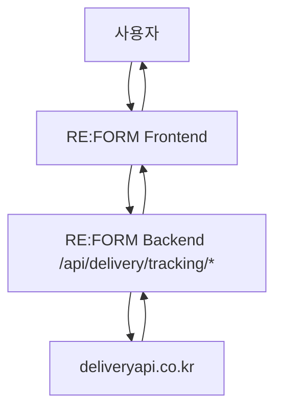

# RE:FORM 택배조회 기능 설명서

> 작성일: 2026-05-12  
> 대상: 기획 / 프론트엔드 / 백엔드 / QA  
> 관련 외부 문서: [deliveryapi tracking docs](https://www.deliveryapi.co.kr/docs#tracking-trace)

---

## 1. 기능 개요

이 기능은 사용자가 택배사와 송장번호를 입력하면 현재 배송 상태와 배송 이력을 조회할 수 있도록 제공하는 기능이다.

현재 구현 범위:

1. 지원 택배사 목록 조회
2. 송장번호 배송 조회

현재 미포함 범위:

- 거래 상세 화면 자동 연동
- 송장번호 저장 기능
- 실시간 폴링 또는 웹훅 연동
- 관리자 배송 모니터링 대시보드

---

## 2. 도입 목적

- 택배 거래 사용자가 외부 사이트로 나가지 않고 배송 상태를 확인할 수 있게 한다.
- 판매자와 구매자 모두 동일한 배송 진행 정보를 확인할 수 있게 한다.
- 거래 관련 문의를 줄이고 신뢰도를 높인다.

---

## 3. 사용자 시나리오

### 3-1. 택배사 목록 확인

1. 사용자가 배송 조회 화면에 진입한다.
2. 프론트가 `/api/delivery/tracking/couriers`를 호출한다.
3. 서버가 외부 택배조회 API에서 지원 택배사 목록을 받아 반환한다.
4. 사용자는 택배사를 선택한다.

### 3-2. 송장번호 조회

1. 사용자가 택배사를 선택한다.
2. 사용자가 송장번호를 입력한다.
3. 프론트가 `/api/delivery/tracking/trace`를 호출한다.
4. 서버가 외부 API에 중계 요청을 보낸다.
5. 응답의 배송 상태, 마지막 이력, 진행 이력을 프론트에 전달한다.
6. 프론트가 배송 상태 타임라인을 렌더링한다.

---

## 4. 시스템 흐름



---

## 5. 기술 설계 요약

### 5-1. 패키지 구조

- Controller: `com.re_form_shop_2605.controller.delivery`
- DTO: `com.re_form_shop_2605.dto.delivery`
- Service: `com.re_form_shop_2605.service.delivery`

### 5-2. 외부 API 호출 방식

- `WebClient` 사용
- 서버 사이드에서만 API Key / Secret Key 사용
- 인증 헤더 형식:
  - `Authorization: Bearer {apiKey}:{secretKey}`

### 5-3. 설정값

현재 프로젝트에서는 아래 properties 키를 사용한다.

```properties
deleveryapi.API-Key=${DELIVERYAPI_API_KEY}
deleveryapi.Secret-Key=${DELIVERYAPI_SECRET_KEY}
```

주의:

- 현재 접두사는 `deliveryapi`가 아니라 `deleveryapi`다.
- 코드도 이 이름에 맞춰 읽도록 구현되어 있다.
- 나중에 설정명을 정리하려면 properties와 코드 둘 다 함께 변경해야 한다.

---

## 6. 기능 정책

### 6-1. 인증 정책

- 현재 내부 API는 인증 없이 호출 가능하게 열어두었다.
- 이유:
  - 택배사 목록은 공개 정보 성격이 강함
  - 배송 조회도 추후 거래 상세 화면 등 공용 영역에서 재사용할 수 있음

향후 필요 시 다음처럼 바꿀 수 있다.

- 로그인 사용자만 사용 가능
- 거래 당사자만 조회 가능
- 관리자만 조회 가능

### 6-2. 입력 정책

- `items`는 최소 1개 이상이어야 한다.
- `courierCode`는 비어 있으면 안 된다.
- `trackingNumber`는 비어 있으면 안 된다.
- `clientId`는 선택값이다.

### 6-3. 응답 정책

- 외부 API 응답 구조를 최대한 그대로 전달한다.
- 성공/실패를 한 요청 안에서 함께 받을 수 있다.
- 개별 송장 실패는 `results[].error`로 확인한다.

---

## 7. 상태 값 활용 가이드

외부 API의 `deliveryStatus`는 아래와 같은 정규화 상태 코드를 제공한다.

| 코드 | 의미 |
| --- | --- |
| `PENDING` | 접수 대기 |
| `REGISTERED` | 접수 완료 |
| `PICKUP_READY` | 집하 준비 |
| `PICKED_UP` | 집하 완료 |
| `IN_TRANSIT` | 배송중 |
| `OUT_FOR_DELIVERY` | 배송 출발 |
| `DELIVERED` | 배송 완료 |
| `FAILED` | 배송 실패 |
| `RETURNED` | 반송 |
| `CANCELLED` | 취소 |
| `HOLD` | 보류 |
| `UNKNOWN` | 알 수 없음 |

프론트에서는 이 값을 기준으로 배지 색상, 타임라인 강조, 완료 여부 표시를 나눌 수 있다.

---

## 8. 향후 확장 포인트

1. 거래 상세 페이지와 연결
2. 판매자 송장번호 저장 기능
3. 구매자/판매자 권한 검증 추가
4. 배송 상태 캐싱
5. 웹훅 기반 실시간 갱신
6. 배송 완료 시 거래 상태와 연동

---

## 9. 구현 파일 목록

- `src/main/java/com/re_form_shop_2605/controller/delivery/DeliveryTrackingController.java`
- `src/main/java/com/re_form_shop_2605/service/delivery/DeliveryTrackingService.java`
- `src/main/java/com/re_form_shop_2605/service/delivery/DeliveryTrackingServiceImpl.java`
- `src/main/java/com/re_form_shop_2605/service/delivery/DeliveryTrackingApiClient.java`
- `src/main/java/com/re_form_shop_2605/dto/delivery/DeliveryCourierListResponseDTO.java`
- `src/main/java/com/re_form_shop_2605/dto/delivery/DeliveryTrackingTraceRequestDTO.java`
- `src/main/java/com/re_form_shop_2605/dto/delivery/DeliveryTrackingTraceResponseDTO.java`
